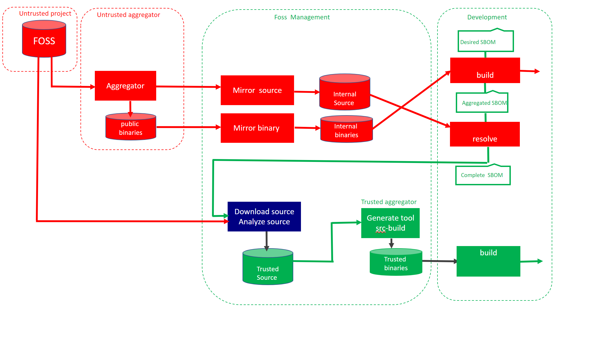

## Overview  

The BOM Resolver could be used both as a [tool](tool.txt)  and a [service](https://services.lammda.se/resolver/alpine/v1/ui) 
which make it useful for both the single developer and a large enterprises. 

The name resolver indicates that this project is about backtracking the Alpine eco system. 

The difference between this project and other projects such as  [Wolfi](https://edu.chainguard.dev/open-source/wolfi/overview/) project is 
the compliance with [Alpine build formats](https://wiki.alpinelinux.org/wiki/APKBUILD_Reference). 


## Flow 

Red indicates software retrieved from Internet that not have been analyzed, green represented analyzed  source being rebuilt. The resolver consist of two containers. 

- Build a docker image by specifying list of packages ( "packages")
- Use the metadata created ( aggregated.json ) together with Alpine build manifest to created the resolved.json 

Mirroring of source and binaries is optional, but  dont expose developers using FOSS. 




[Alpine Linux](https://www.alpinelinux.org/) aggregates open source projects by 

- Compile source code into binaries 
- Provides binaries as packages 
- Support for many architectures
  - X86 
  - ARM 

Without aggregation, developers must build the binaries from source on their own. 
For embedded systems frameworks such as [Buildroot](https://buildroot.org/), [Yoctoproject](https://www.yoctoproject.org/) and [PTXDIST](https://www.ptxdist.org/) exists. 


| Repository                   |                                                              |
| ---------------------------  | ------------------------------------------------------------ |
| Public binary packages       | [http://dl-cdn.alpinelinux.org/alpine](http://dl-cdn.alpinelinux.org/alpine) |
| Mirror of public repository  | [https://services.lammda.se/alpine/public/](https://services.lammda.se/alpine/public/)               |
| Isolated rebuild of packages | [https://services.lammda.se/alpine/approved/](https://services.lammda.se/alpine/approved/)               |
| Customized packages          | [https://services.lammda.se/alpine/custom/](https://services.lammda.se/alpine/custom/)               |

## Workflow 


### Binary build 
  docker.io/bomres/base_os_alpine use two config files as input and generates a container. 
  The first file is the list of all  [**desired**](desired.txt)  packages. 
  [**settings**](settings.txt) file defines which version of Alpine among other settings. 


 Start with the [**desired**](desired.txt) list of *binary* packages 
   - The package manager resolve all [**binary**](os.apk.txt) dependencies. 
   - APKINDEX.tar.gz enrich the file above into [**aggregated.json**](aggregated.json). 
   - The container is built twice. 
     - First pass against remote repository ( see table above ) 
     - Second pass from [local disk](download.txt)
### Resolve binary  
  When all metadata are stored locally in a consistent state, the backtrack 
  process could be executed. 

  docker.io/bomres/alpine_resolver is the second container it takes [**aggregated.json**](aggregated.json). as 
  input and cross check against [aports](https://github.com/alpinelinux/aports). 

  The cross check between the package manager and the build manifest results in [resolved.json](resolved.json).

  Please note that the purpose of this project is about 
  - Generate a complete SBOM from a binary build. 
  - Rebuild the binaries in isolation based on SBOM. 

  This approach is also a proof of correctness of the SBOM, when done the content could 
  be exported to [SPDX](https://spdx.dev/), [Cyclone DX](https://cyclonedx.org), etc. 

### Iterate for depth 

  Dependencies for the base layer in microservices ends with the linux kernel interface. 

  it is similar to ancestry, either you go wide by generation, or deep following one specific branch. 

  [CISA](https://www.cisa.gov/sites/default/files/publications/Dec15-SBOM-a-rama-slides.pdf) have a paper about depth and effectiveness.  The resolved.json file have a section that indicates if 

 all branches have been resolved or not. 

```
        "resolver": {
            "status": false,

```
 Currently this is not automated in the resolver, but it is possible. New dependencies found by the resolver must be added to the 
 desired sbom so it covers all [packages](iterate.txt) in the product. Alpine promote flexibility and therefore [lighttpd](https://www.lighttpd.net/) supports 
 [openldap](https://www.openldap.org/). 


The APKBUILD file controls how lighttpd is built 
```
 build() {
        ./configure \
                --without-gdbm \
                --with-pcre2 \
                --with-dbi \
                --with-ldap \
                --with-openssl \
                --with-zstd \
                --with-brotli \
                --with-lua
        make
```
Using buildroot, ptxdist etc this package could be optimized for [Kubernetes](https://kubernetes.io/) which provides functionality not needed in the build. 

However there is a tradeoff of being compliant with Alpines package strategy or customization/hardening. 

### Download source code for product 

When the resolver reports true, it is time to download all source code required to build. 
   - External packages *.tar.gz 
   - External patches 
   - Contributions by Alpine
     - Patches 
     - Build manifests ( APKBUILD)
     - Additional files  

All downloaded files are adjusted for rebuild and stored in the [source directory](source.txt)


### Analyze code 

The resolver just prepare the code for analyze.  To comply with different standards the analyze should cover many aspects, such as composition, legal and security. 

Patches are a little bit tricky to analyze. 

One option to analyze patches is 

- unpack and analyze the original source 
- store report of analyze ( analyze-1 ) 
- apply patches to the source 
- analyze the source code again
- store the report as ( analyze-2 ) 
- compare the the two analyze reports. 

if analyze-1 reports security issues and analyze-2 not, we could assume that the patch improved security. 

if analyze-1 reports security issues and analyze-2 still reports issues, the patch was of no use. 

if analyze-1 reports no security issues, but analyze-2 does, when the patch is an attack. 


### Prepare build tool 

Rootless [Podman](https://podman.io) is required to use the resolver. This enable build to be executed as root inside the container, but still execute as a normal 
user on the host. 

For scalabity build jobs could be deployed as pods in Kubernetes. With overlay file system temporary files could be kept locally. 

Alpine supports many targets such as X86 and ARM, the tool should therefore be containerized. 

The tool must be adopted for the product being built. The Bom resolver generates a package list for the [tool](tools.txt) similar to the 
[product](desired.txt). 


### To be continued  

##  

Presentation of Alpine Bom Resolver at [Fossdem 2022](https://archive.fosdem.org/2022/schedule/event/sbom_resolver_generating_detailed_sboms_for_alpine/)

The source code is submitted under Apache License 2.0 as open source on  [Github](https://github.com/Nordix/bomres)


